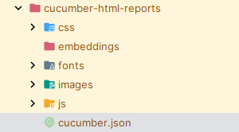

## ¿Why do I need to generate a file that consolidates all the results of each feature execution? 

In this example, karate-dsl generates the test results in a JSON file for each of the executed feature files. 
* examples-users.getData.json
* examples-users.postData.json


I have created a method that consolidates the two JSON files with the results into a single file called **cucumber.json**

_method can also consolidate more than 2 json files_



Then, you can use the cucumber.json file in the Xray API to upload your consolidated evidence.


Finally, you will observe your executions in a Issue of Test Execution


The method `generateCucumberReport` performs all the tasks mentioned.


```java
@Test
    void testParallel() {
    Results results = Runner.path("classpath:examples")
    .outputCucumberJson(true)
    .karateEnv("dev")
    .parallel(5);
    generateCucumberReport(results.getReportDir());
    assertEquals(0, results.getFailCount(), results.getErrorMessages());
}
```

You can also modify the paths of the files.

```java
private static final String JSON_DIRECTORY = "/cucumber-html-reports";
private static final String CUCUMBER_JSON = "/cucumber.json";
```

```java
    private static void writeResultsToOneFile(JSONArray totalResults) throws IOException {
        File currentDirectory = new File((new File(".")).getAbsolutePath());
        String absolutePath = currentDirectory.getCanonicalPath();

        File directory = new File(absolutePath + "/" + TARGET_DIRECTORY + JSON_DIRECTORY);
        if (!directory.exists()) {
            directory.mkdirs();
        }

        File cucumberJsonFile = new File(directory + CUCUMBER_JSON);
        try (FileWriter fileWriter = new FileWriter(cucumberJsonFile)) {
            fileWriter.write(totalResults.toJSONString());

        }

        logger.info("cucumber.json file has been created at: " + cucumberJsonFile.getAbsolutePath());
    }
```
Note that upon completion of the tests, you will receive a message like this:
```console
INFO: cucumber.json file has been created at: ...\karate-cucumber-xray\target\cucumber-html-reports\cucumber.json
```
